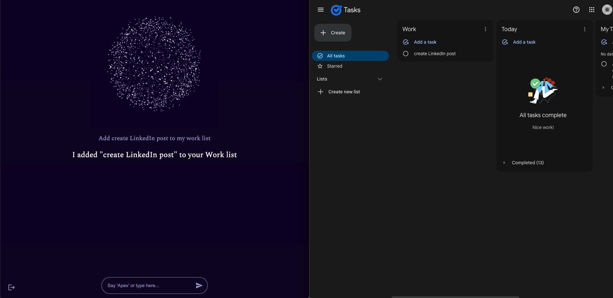
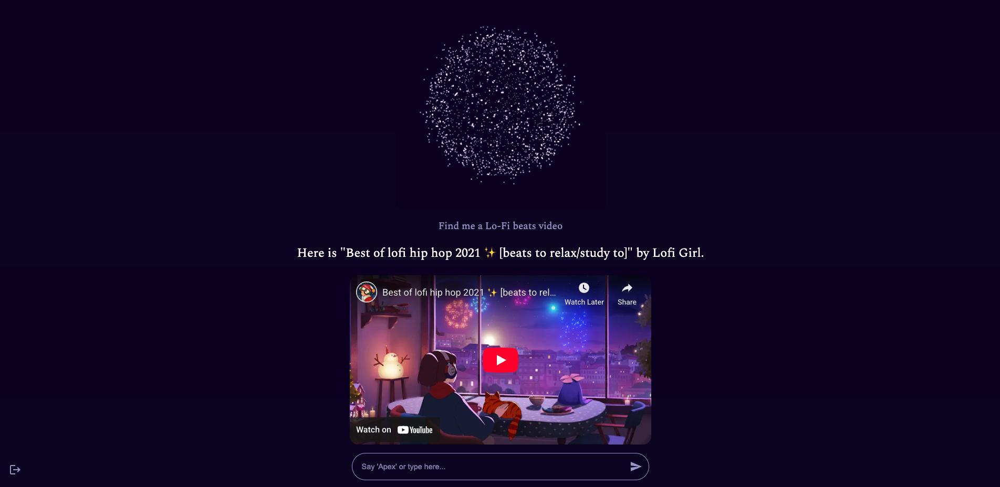

# Apex | AI Voice Assistant

Apex is a full-stack web app that makes productivity easier by bridging the gap between your voice and the Google ecosystem. By interpreting natural language, executing structured workflows, and providing a vocal response, Apex allows users to manage their Google tools (Calendar, Tasks, YouTube) hands-free.

## Technologies Used
### Tech Stack
- **Languages/Frameworks:** TypeScript, React, Next.js, Node.js
- **DevOps & Infrastructure:** AWS (ECR/ECS), Docker, GitHub Actions
- **Database:** PostgreSQL
- **Testing:** Vitest (Unit/Integration), Playwright (E2E)

### Integrations & APIs
- **Intelligence:** OpenAI API (Function Calling & JSON Schema)
- **Voice Interface:** Web Speech API (Real Time Speech-To-Text), Google Text-to-Speech API (Vocal Responses)
- **Productivity & Tools:** Google Calendar API, Google Tasks API, Youtube Data API, Google Weather API

## System Architecture & Logic Flow
1. **Voice Trigger & Transcription**: The front end uses the Web Speech API to transcribe the user's speech and detect the wake word ("Apex"). Once activated, the audio is transcribed and sent to the Next.js backend.

2. **Intent Classification**: The backend utilizes OpenAI’s GPT models to classify the raw query into high-level categories (e.g. Calendar, Tasks, Other).

3. **Domain-Specific Routing**: Requests are routed to specialized controllers (e.g. CalendarController). Here, the system uses OpenAI Function Calling to map natural language to specific, pre-defined JSON schemas.

4. **Action Execution**: The system executes the identified function (e.g. addEventToCalendar) by interfacing with external REST APIs (Google Calendar, Tasks, etc.). It then creates a natural language confirmation based on the API's response.

5. **Multimodal Feedback**: The final response is returned to the client, where it is simultaneously rendered in the UI and converted to audio using Google's Text-to-Speech API for a hands-free experience.

## Implementation Examples

### Google Tasks Integration

### Youtube Integration
